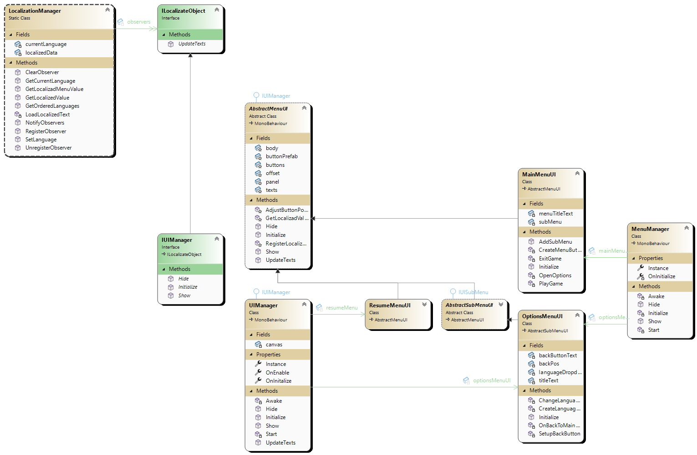

**Resumo do Design do Sistema de Menus**

### 1. Estrutura Geral
O sistema de menus segue um design baseado em hierarquia de menus e submenus, utilizando padrões como Singleton, Observer e Factory.

### 2. Gerenciamento de Menus
- **MenuManager (Singleton)**:
  - Responsável por inicializar e manter o estado dos menus principais.
  - Registra menus como observadores do sistema de localização.
  - Implementa a lógica de exibição e ocultamento do menu principal.

```csharp
public class MenuManager : MonoBehaviour
{
    public static MenuManager Instance { get; private set; }
    private static bool OnInitialize = false;
    
    private void Awake()
    {
        if (Instance == null)
        {
            Instance = this;
            DontDestroyOnLoad(gameObject);
        }
        else
        {
            Destroy(gameObject);
        }
    }

    private void Start() => Initialize();
}
```

### 3. Estrutura de Menus
- **AbstractMenuUI (Classe Base Abstrata)**:
  - Define as funcionalidades comuns a todos os menus (exibir, ocultar, atualizar textos, posicionamento de botões).
  - Possui uma lista de botões e textos localizados.

```csharp
public abstract class AbstractMenuUI : MonoBehaviour, IUIManager
{
    protected GameObject panel;
    protected ButtonResponse[] buttons;
    protected List<TextResponse> texts = new();
    
    public virtual void Initialize() { throw new System.NotImplementedException(); }
    public void Show() => panel.SetActive(true);
    public void Hide() => panel.SetActive(false);
}
```

- **MainMenuUI** (Herdado de AbstractMenuUI)
  - Gerencia o menu principal e sua interação com submenus.
  - Define botões como "Jogar", "Opções" e "Sair".

```csharp
public class MainMenuUI : AbstractMenuUI
{
    private AbstractSubMenuUI subMenu;
    public override void Initialize() => CreateMenuButtons();
    public void AddSubMenu(AbstractSubMenuUI submenu) => subMenu = submenu;
}
```

- **AbstractSubMenuUI** (Herdado de AbstractMenuUI)
  - Representa submenus que dependem de um menu principal.

```csharp
public abstract class AbstractSubMenuUI : AbstractMenuUI, IUISubMenu
{
    protected IUIManager parent;
    public void AddParent(IUIManager submenu) => parent = submenu;
}
```

- **OptionsMenuUI** (Herdado de AbstractSubMenuUI)
  - Gerencia a interface de opções do jogo, como mudança de idioma.

```csharp
public class OptionsMenuUI : AbstractSubMenuUI
{
    private TMP_Dropdown languageDropdown;
    private void ChangeLanguage(int lang) { /* Implementação */ }
}
```

### 4. Padrão Factory para Botões
O **ButtonFactory** é utilizado para criar botões dinamicamente com base em configurações predefinidas.

```csharp
public static class ButtonFactory
{
    public static ButtonResponse CreateButton(
        LocalizationFields textKey,
        GameObject buttonPrefab,
        System.Action onClickAction,
        Transform parent)
    {
        GameObject newButton = Object.Instantiate(buttonPrefab, parent);
        TMP_Text buttonText = newButton.GetComponentInChildren<TMP_Text>();
        buttonText.text = LocalizationManager.GetLocalizadMenuValue(textKey);

        Button button = newButton.GetComponent<Button>();
        button.onClick.AddListener(() => onClickAction?.Invoke());

        return new ButtonResponse(){ KeyText = textKey, Button = button, Text = buttonText };
    }
}
```

### 5. Padrão Observer para Localização
Os menus são registrados como observadores no **LocalizationManager**, permitindo a atualização dinâmica de textos ao mudar o idioma.

```csharp
public interface ILocalizateObject // observers
{
    void UpdateTexts();  // Atualiza todos os textos na UI
}
public interface IUIManager : ILocalizateObject
{
    void Initialize();
    void Show();
    void Hide();
}
```
```csharp
//Subject
public static class LocalizationManager
{
    private static List<ILocalizateObject> observers = new();
    private static Dictionary<LocalizationCategory, Dictionary<string, string>> localizedData
        = new Dictionary<LocalizationCategory, Dictionary<string, string>>();

    private static SupportedLanguages currentLanguage = SupportedLanguages.Portuguese;  // Idioma padrão

    public static string GetLocalizedValue(LocalizationCategory category, LocalizationFields key);
    public static bool SetLanguage(SupportedLanguages language)
    {
        if (currentLanguage != language)
        {
            currentLanguage = language;
            localizedData.Clear();
            NotifyObservers();
            Debug.Log($"Language set to {language}. Localization data cleared.");
            return true;
        }
        return false;
    }

    public static string GetLocalizadMenuValue(LocalizationFields key) {
        return GetLocalizedValue(LocalizationCategory.Menus, key);
    }

    public static void RegisterObserver(ILocalizateObject loc) {
        observers.Add(loc);
    }
    public static void UnregisterObserver(ILocalizateObject loc);
    public static void NotifyObservers();
    public static void ClearObserver();
    /*---------------------*/
    private static void LoadLocalizedText(LocalizationCategory category);
    public static SupportedLanguages GetCurrentLanguage();
    public static List<SupportedLanguages> GetOrderedLanguages();
}
``` 



### Conclusão
O design do sistema de menus utiliza abstração para separar responsabilidades, padrões de projeto para reutilização de código e modularidade para expansão futura. A combinação de **Singleton, Factory e Observer** garante flexibilidade e facilidade de manutenção.

