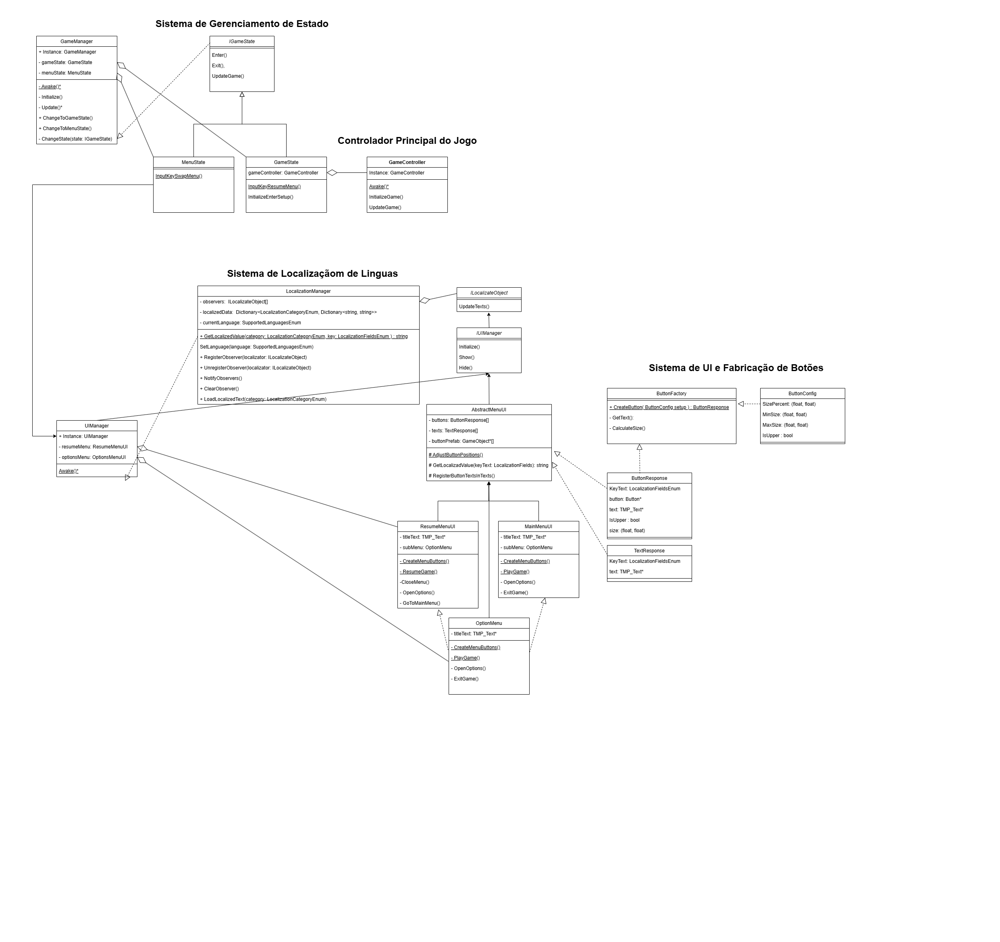

# Relatório do Projeto Tower Defense

* **Aluno:** Henricky de Lima Monteiro - 475075
* **Vídeo Descritivo?:** [youtu.be/fuSjeN2fQZQ](https://youtu.be/fuSjeN2fQZQ)
* **Github:** [github.com/HenrickyL/Project-TD](https://github.com/HenrickyL/Project-TD)

## 1. Introdução
Este documento apresenta as decisões de arquitetura e padrões de projeto aplicados no desenvolvimento do jogo Tower Defense em Unity. O projeto segue os princípios SOLID e utiliza padrões de projeto GoF para garantir um código modular, reutilizável e de fácil manutenção.

## 2. Arquitetura do Projeto
- **Engine:** Unity
- **Linguagem:** C#
- **Paradigma:** Programação Orientada a Objetos (POO)
- **Princípios:** SOLID, separação entre interface e lógica
- **Padrões de Projeto Utilizados:**
  - State
  - Factory Method
  - Singleton
  - Observer
  

  
## 3. Padrões de Projeto Aplicados

* [Sistema de Menu](Menu.md) - Singleton, Observer e Factory


### 3.1 **GameManager (Singleton)**
O **GameManager** é responsável por gerenciar os estados do jogo, como **GameState** (jogabilidade normal), **MenuState** (menu de pausa) e **MapEditState** (edição de mapa). Ele utiliza o padrão **Singleton** para garantir uma única instância global.

#### Responsabilidades:
- Controlar a transição entre estados do jogo.
- Gerenciar a inicialização e destruição de objetos.
- Garantir que apenas um estado esteja ativo por vez.

```csharp
public class GameManager : MonoBehaviour // Singleton
{
    private IGameState currentState;
    public static GameManager Instance { get; private set; }

    private void Awake()
    {
        if (Instance == null)
        {
            Instance = this;
            DontDestroyOnLoad(gameObject);
        }
        else
        {
            Destroy(gameObject);
        }
    }

    public void ChangeState(IGameState newState)
    {
        currentState?.Exit();
        currentState = newState;
        currentState.Enter();
    }
}
```

#### Padrões:
- **Singleton:** Garante uma única instância do **GameManager**.
- **State:** Gerencia os estados do jogo (GameState, MenuState, etc.).

---

### 3.2 **GameController**
O **GameController** é responsável por gerenciar a lógica principal do jogo, como a geração de inimigos, interação das torres com os inimigos e atualização do estado do jogo.

#### Responsabilidades:
- Gerenciar a criação do mapa e a posição dos tiles.
- Controlar a geração de inimigos e projéteis.
- Atualizar o estado do jogo a cada frame.

```csharp
public class GameController : MonoBehaviour
{
    public static GameController Instance { get; private set; }

    private void Awake()
    {
        if (Instance == null)
        {
            Instance = this;
        }
        else
        {
            Destroy(gameObject);
        }
    }

    public void InitializeGame()
    {
        StartCoroutine(MapGenerator.GenerateMap(_board, tileContentFactory, boardSize));
    }

    public void UpdateGame()
    {
        // Lógica de atualização do jogo
    }
}
```

#### Padrões:
- **Singleton:** Garante uma única instância do **GameController**.
- **Factory Method:** Utilizado para criar inimigos, torres e projéteis.

---

### 3.3 **MapGenerator**
O **MapGenerator** é responsável por gerar o mapa do jogo, incluindo a topologia, obstáculos e decorações. Ele poderia ser implementado com o padrão **Builder**, mas foi feito de forma procedural.

#### Responsabilidades:
- Gerar a topologia do mapa.
- Posicionar obstáculos e decorações.
- Inicializar os tiles do mapa.

```csharp
public static class MapGenerator
{
    public static IEnumerator GenerateMap(GameBoard board, GameTileContentFactory contentFactory, Vector2Int size)
    {
        _board = board;
        _size = size;
        _board.SetEnable(true);
        _tileContentFactory = contentFactory;

        yield return GenerateTopology();
        yield return PlaceObstacles();
        yield return DecorateEnvironment();
    }
}
```

#### Padrões:
- **Factory Method:** Utilizado para criar os conteúdos dos tiles (paredes, torres, etc.).

---

### 3.4 **Enemy e EnemyFactory**
O **Enemy** representa os inimigos do jogo, que seguem um caminho pré-definido no mapa. O **EnemyFactory** é responsável por criar instâncias de inimigos com propriedades aleatórias.

#### Responsabilidades:
- **Enemy:** Controlar o movimento e o estado do inimigo (spawn, movimento, morte).
- **EnemyFactory:** Criar inimigos com propriedades aleatórias (escala, velocidade, etc.).

```csharp
public class Enemy : GameEntity
{
    public void SpawnOn(GameTile tile)
    {
        TileFrom = tile;
        TileTo = tile.NextTileOnPath;
        ChangeState(new SpawnState(tile));
    }
}

public class EnemyFactory : AbstractGameEntityFactory
{
    [SerializeField] Enemy prefab = default;

    public Enemy Get()
    {
        Enemy enemy = base.Get<Enemy>(prefab);
        enemy.Initialize(scale.RandomValueInRange, speed.RandomValueInRange, pathOffset.RandomValueInRange);
        return enemy;
    }
}

public abstract class AbstractGameAssetFactory : ScriptableObject
{
    Scene scene;
    protected T CreateGameAssetInstance<T>(T prefab) where T : GameAsset;

    protected T Get<T>(T prefab) where T : GameAsset
    {
        if (!(prefab is T))
            throw new System.InvalidCastException($"O prefab configurado não é do tipo esperado: {typeof(T)}");

        T instance = CreateGameAssetInstance(prefab as T);
        instance.OriginFactory = this;
        return instance;
    }

    public virtual void Reclaim(GameAsset content)
    {
        Debug.Assert(content.OriginFactory == this, "Wrong factory reclaimed!");
        Destroy(content.gameObject);
    }
}
```

#### Padrões:
- **Factory Method:** Utilizado para criar inimigos.
- **State:** Gerencia os estados do inimigo (SpawnState, MovimentState, DeathState).

---

### 3.5 **Tower e TowerFactory**
As torres são entidades que atacam os inimigos. Cada tipo de torre (Laser, Mortar) tem comportamentos diferentes. O **TowerFactory** é responsável por criar instâncias de torres.

#### Responsabilidades:
- **Tower:** Controlar o comportamento da torre (ataque, aquisição de alvo).
- **TowerFactory:** Criar instâncias de torres.

```csharp
public class LaserTower : Tower
{
    public override void GameUpdate()
    {
        if (TrackTarget(ref _target) || AcquireTarget(out _target))
        {
            Shoot();
        }
        else
        {
            ResetLaser();
        }
    }
}

public class GameTileContentFactory : AbstractGameAssetFactory
{
     [SerializeField]
    GameTileContent destinationPrefab = default;

    [SerializeField]
    GameTileContent emptyPrefab = default;

    [SerializeField]
    GameTileContent wallPrefab = default;

    [SerializeField]
    GameTileContent spawnPoint = default;

    [SerializeField]
    GameTileContent[] towerPrefabs = default;

    public GameTileContent Get(TowerType type)
    {
        Debug.Assert((int)type < towerPrefabs.Length, "Unsupported tower type!");
        GameTileContent prefab = towerPrefabs[(int)type];
        Tower tower = prefab.Element as Tower;
        if (tower != null) { 
            Debug.Assert(type == tower.TowerType, "Tower prefab at wrong index!");
            return Get(prefab);
        }
        else
        {
            throw new System.Exception("Invalid Context Type");
        }
    }

    public GameTileContent Get(GameTileContentType type)
    {
        switch (type)
        {
            case GameTileContentType.Destination: return Get(destinationPrefab);
            case GameTileContentType.Empty: return Get(emptyPrefab);
            case GameTileContentType.Wall: return Get(wallPrefab);
            case GameTileContentType.SpawnPoint:return Get(spawnPoint);
        }
        Debug.Assert(false, "Unsupported non-tower type: " + type);
        return null;
    }
}
```

#### Padrões:
- **Factory Method:** Utilizado para criar torres.


---

### 3.6 **State Machine para Inimigos e Torres**
O sistema de estados é utilizado para gerenciar o comportamento de inimigos e torres. Cada estado (SpawnState, MovimentState, DeathState) define o comportamento do inimigo em diferentes fases.

#### Responsabilidades:
- Gerenciar a transição entre estados.
- Definir o comportamento do inimigo em cada estado.

```csharp
public interface IEntityState
{ 
    void Enter(GameElement context);
    void UpdateState();
    void Exit();
    string Name();
}

 public abstract class BaseState : IEntityState
 {
     private GameElement _entity = default;
     private string _name = default;

     protected GameElement Entity => _entity;

     public BaseState(string name) { 
         _name = name;
     }
     public virtual void Enter(GameElement context) {
         _entity = context;
     }
     public virtual void UpdateState();
     public virtual void Exit();
     public string Name();
 }

public sealed class StateMachine
{
    private BaseState _currentState;
    private GameElement _context;

    public BaseState CurrentState { get { return _currentState; } }
    public GameElement Context { get { return _context; } }

    public string CurrentStateName => _currentState.Name();

    public void UpdateState()
    {
        _currentState?.UpdateState();
    }

    public void ChangeState(GameElement context, BaseState newState)
    {
        _context = context;
        _currentState?.Exit();
        _currentState = newState;
        _currentState.Enter(_context);
    }
}
```

#### Padrões:
- **State:** Gerencia os estados do inimigo e das torres.


<!--  -->

## 4. Conclusão
O projeto Tower Defense foi desenvolvido com foco em boas práticas de arquitetura de software, utilizando padrões de projeto como **Singleton**, **Factory Method**, **State** e **Observer**. A separação de responsabilidades e a modularidade do código garantem uma base sólida para expansões futuras.
